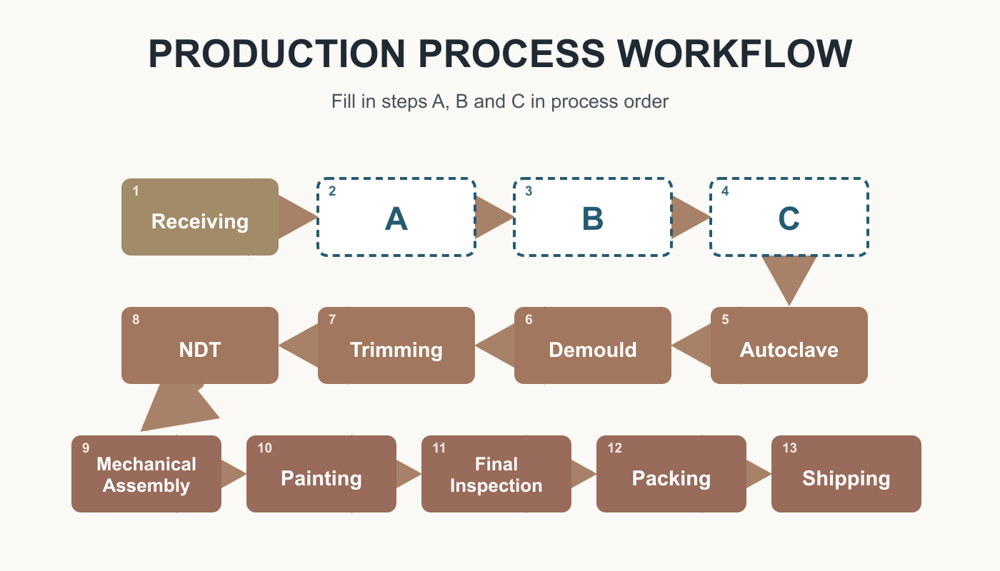
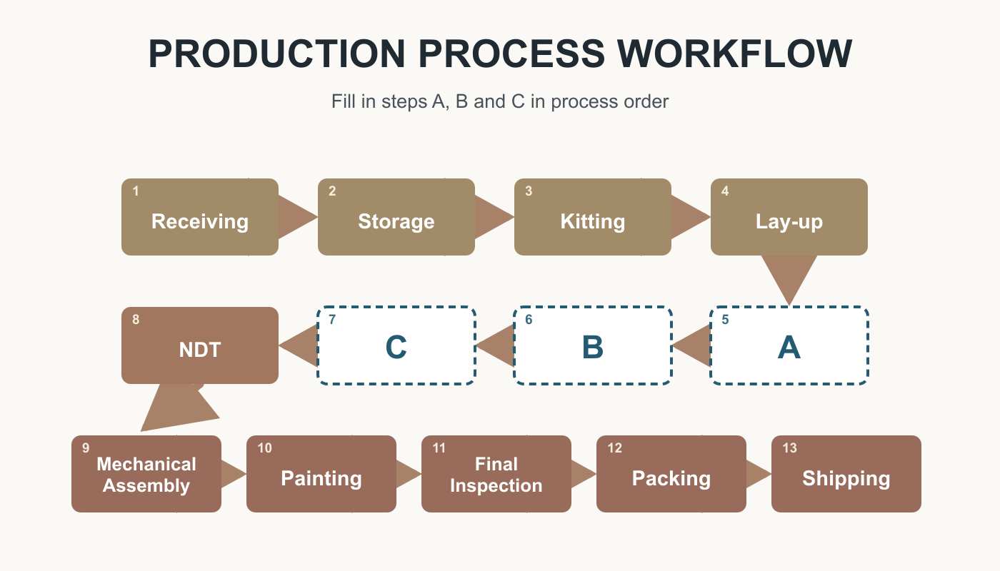
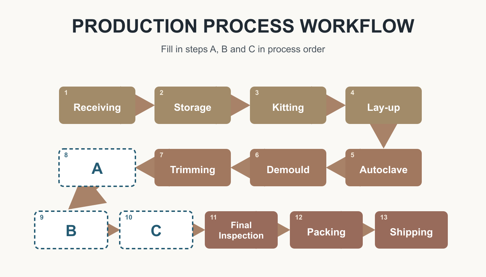
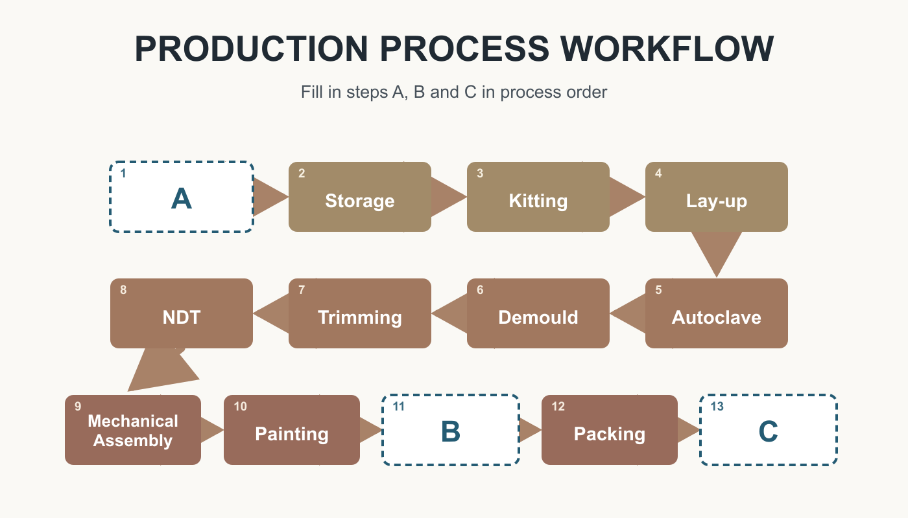
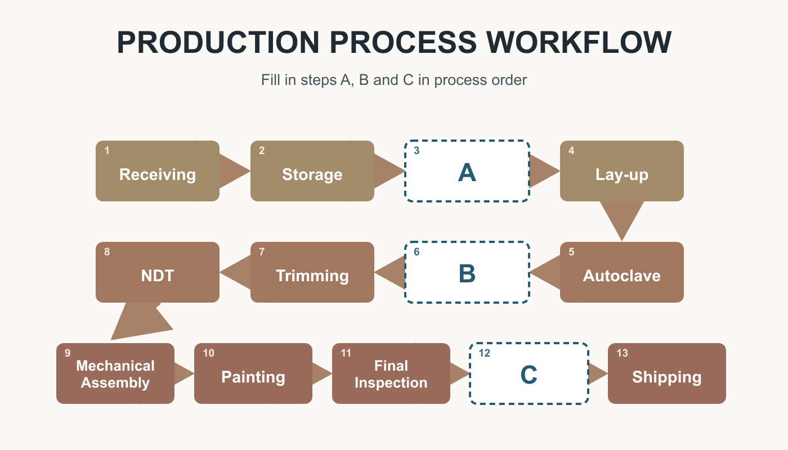

# REVISION 1 — workflow questions 19–23

The diagrams redraw the 13 steps in the supplied production workflow. Follow the arrows from Receiving to Shipping. Each question has three missing steps, marked A, B and C. Choose the sequence that correctly fills all three blanks.

## 19

Which steps belong in blanks A, B and C?

A. Storage → Lay-up → Kitting 
B. Storage → Kitting → Lay-up 
C. Kitting → Storage → Lay-up 
D. Storage → Kitting → Autoclave

**Answer: B** (Storage → Kitting → Lay-up)

## 20

Which steps belong in blanks A, B and C?

A. Autoclave → Trimming → Demould 
B. Demould → Autoclave → Trimming 
C. Autoclave → Demould → Trimming 
D. Autoclave → NDT → Trimming

**Answer: C** (Autoclave → Demould → Trimming)

## 21

Which steps belong in blanks A, B and C?

A. NDT → Mechanical Assembly → Painting 
B. Mechanical Assembly → NDT → Painting 
C. NDT → Painting → Mechanical Assembly 
D. NDT → Mechanical Assembly → Packing

**Answer: A** (NDT → Mechanical Assembly → Painting)

## 22

Which steps belong in blanks A, B and C?

A. Storage → Final Inspection → Shipping 
B. Receiving → Packing → Shipping 
C. Receiving → Final Inspection → Packing 
D. Receiving → Final Inspection → Shipping

**Answer: D** (Receiving → Final Inspection → Shipping)

## 23

Which steps belong in blanks A, B and C?

A. Kitting → Trimming → Packing 
B. Kitting → Demould → Packing 
C. Kitting → Demould → Shipping 
D. Lay-up → Demould → Packing

**Answer: B** (Kitting → Demould → Packing)
